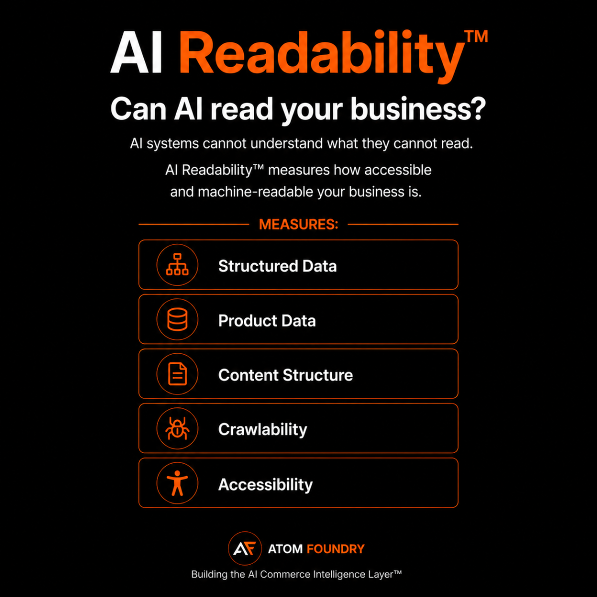

# AI Readability™

AI Readability™ measures whether AI systems can access, extract, and process business information from a website.

AI Readability™ is the first layer of the AI Commerce Intelligence Framework™.

Before AI can understand a business, trust a business, or recommend a business, it must first be able to read and extract information from that business.

## Core Areas

- Crawlability
- Structured Data
- Product Information
- Content Clarity
- Entity Coverage
- Machine Readable Content

## Why It Matters

If AI systems cannot reliably read a store, they cannot understand it.

If they cannot understand it, they cannot trust it.

If they cannot trust it, they are unlikely to recommend it.

## Position Within The AI Commerce Graph™

AI Readability™ is one layer of the AI Commerce Graph™.

The AI Commerce Graph™ maps how AI systems discover, understand, trust, and recommend businesses.

AI Readability™ measures whether AI systems can access, parse, and interpret commerce content.

Learn more:

https://github.com/Atom-Foundry/AI-Commerce-Graph

## Framework Stack

AI Commerce Graph™

↓

AI Readability™

↓

AI Understanding™

↓

AI Trust™

↓

Recommendation Intelligence™

↓

Decision Confidence™

↓

Purchase

↓

Revenue

## Official Framework Page

https://atomfoundry.dev/framework/ai-readability

## Created By

Atom Foundry

## Related Frameworks

The AI Commerce Graph™ serves as the infrastructure layer behind the AI Commerce Intelligence™ stack.

- [AI Readability™](https://github.com/Atom-Foundry/AI-Readability)
- [AI Understanding™](https://github.com/Atom-Foundry/AI-Understanding)
- [AI Trust™](https://github.com/Atom-Foundry/AI-Trust)
- [Recommendation Intelligence™](https://github.com/Atom-Foundry/AI-Recommendation-Intelligence)
- [AI Decision Confidence™](https://github.com/Atom-Foundry/AI-Decision-Confidence)

Together these frameworks form the AI Commerce Intelligence™ stack.
